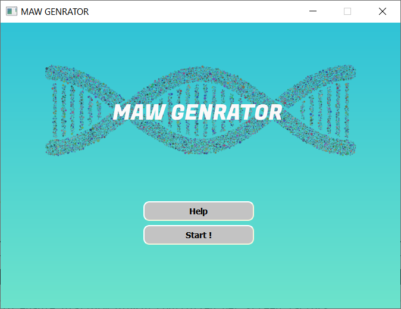
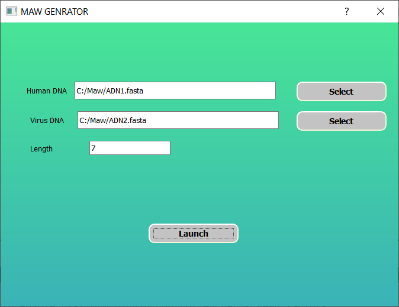
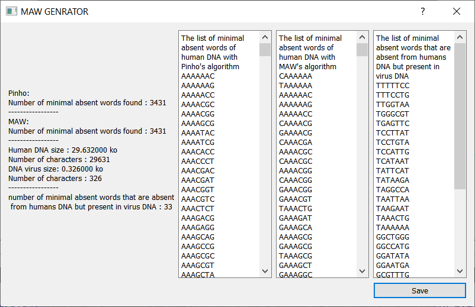
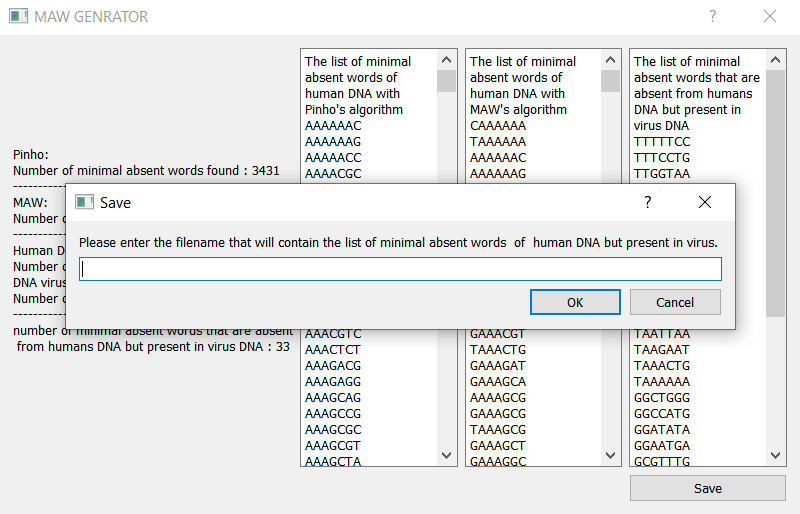

# maw-generator

In March 2015, a group of researchers  discovered  **three minimal sequences**  found in the genomes of the Ebola virus, absent from the human DNA, (TTTCGCCCGACT), (TACGCCCTATCG), (CCTACGCGCAAA).

Read more about it :

[Raquel M. Silva et al,2015 Three minimal sequences  found in Ebola virus genomes and absent from  human DNA](https://www.ncbi.nlm.nih.gov/pmc/articles/PMC4514932/)

since  we know that  these  three minimal sequences are present in the genomes of the virus and absent from the human  genome.

this  discovery  will  make  it possible to target virus cells  without  being  afraid to touch  human  cells.

MAW GENERATOR can compute  these  special minimal absent words.

# Install

 - Clone  this repository
 - Install c++
 - Install qt

# Hwo  it  works ?
## Compute  MAWs
Click on start then :
 1. Specify the path to the file containing the DNA that  we  want to compute  its minimal absent words (eg  human DNA) by clicking on "Select".
 2. Specify the path to the file containing the other DNA (eg DNA from Ebola virus) by clicking on "Select".
 3. Give the length of the minimal absent words "length"

click on "launch" and we  get :
 - The list of minimal absent words of human DNA with  MAW's  algorithm.
 - The list of minimal absent words of human DNA with  Pinho's  algorithm
 -The list of minimal absent words  that are absent from  humans DNA but present in virus DNA
 - And other informations.

 
The fastest  algorithm to compute minimal absent words  is MAW, then  Pinho  Algorithm.

Read more about the two  algortithms :

MAW : [Linear-time computation of minimal absent words  using  suffix  array.](https://bmcbioinformatics.biomedcentral.com/articles/10.1186/s12859-014-0388-9)

Pinho : [On finding minimal absent words.](https://bmcbioinformatics.biomedcentral.com/articles/10.1186/1471-2105-10-137)

The two  algorithms  were  optimized before use in this application.

You can save the result by clicking on "Save" :
 
